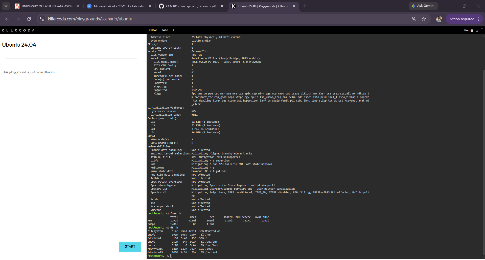
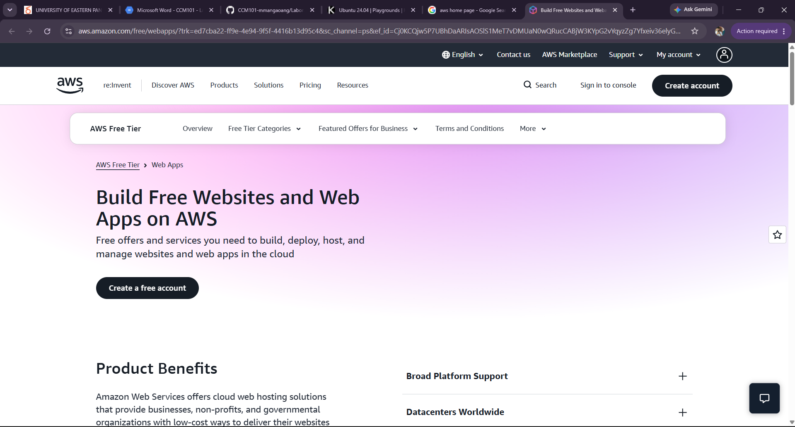
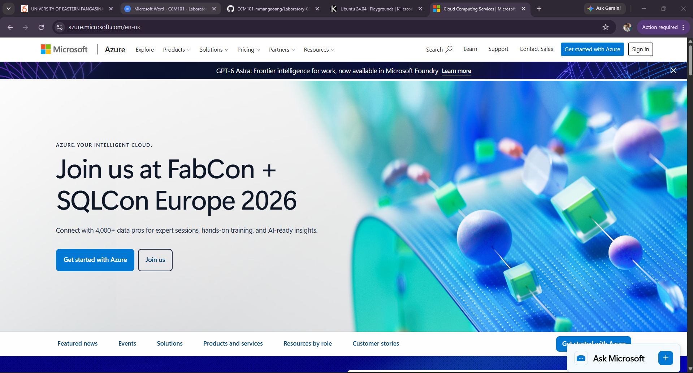
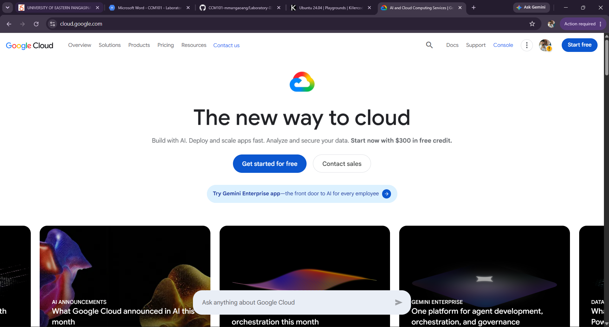
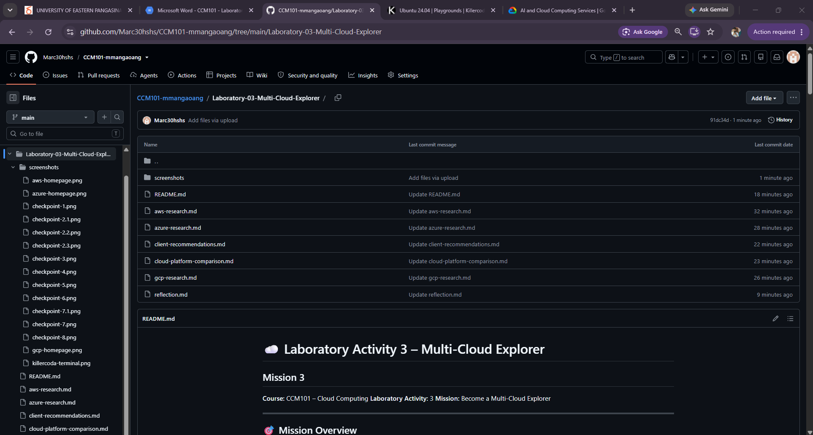

# ☁️ Laboratory Activity 3 – Multi-Cloud Explorer

## Mission 3

**Course:** CCM101 – Cloud Computing
**Laboratory Activity:** 3
**Mission:** Become a Multi-Cloud Explorer

---

## 🎯 Mission Overview

This activity introduced me to three well-known cloud computing platforms: **Amazon Web Services (AWS), Microsoft Azure, and Google Cloud Platform (GCP)**.

The goal of the activity was not only to learn the services offered by each provider but also to understand how a cloud platform can be selected based on the needs of a specific organization. Factors such as existing technology, expected workload, scalability, cost, and future plans should be considered before choosing a provider.

---

# 📚 Mission Objectives

By completing this laboratory activity, I was able to:

* Examine the basic features of AWS, Azure, and Google Cloud.
* Learn about commonly used cloud services.
* Match similar services offered by different providers.
* Evaluate cloud solutions based on different client situations.
* Select a suitable provider for specific business requirements.
* Use Linux commands to examine a virtual environment.
* Record my findings using Markdown.
* Organize and present my cloud computing activities through GitHub.

---

# ☁️ Cloud Platforms Explored

## Amazon Web Services (AWS)

**AWS** is a cloud platform that provides services for areas such as virtual computing, storage, databases, networking, security, analytics, and application development. Its infrastructure is organized into Regions and Availability Zones to support reliable cloud deployments.

## Microsoft Azure

**Microsoft Azure** is Microsoft's cloud computing platform. It provides infrastructure, databases, networking, security, AI, and other cloud services. Azure is particularly useful for organizations that already depend on Microsoft technologies and services.

## Google Cloud

**Google Cloud** is Google's cloud computing platform. It provides solutions for computing, storage, databases, data analytics, artificial intelligence, machine learning, and Kubernetes-based applications.

---

# 🐧 Checkpoint 7 – Linux System Investigation

## Commands I Used

### 1. Checking the Linux Version

```bash
lsb_release -a
```

I used this command to determine the Linux distribution, release number, and codename installed in the environment.

### 2. Checking the Kernel

```bash
uname -r
```

This command was used to find the current Linux kernel version.

### 3. Examining the CPU

```bash
lscpu
```

This displays details about the processor, architecture, number of CPUs, cores, threads, and other hardware information.

### 4. Checking Memory

```bash
free -h
```

I used this command to view the system's RAM, available memory, used memory, and swap space in an easier-to-read format.

### 5. Checking Storage

```bash
df -h
```

This command shows the storage capacity, used space, and remaining space of the system's mounted filesystems.

---

# 🔎 Checkpoint 7 – Linux Investigation Results

For this part of the activity, I opened a **KillerCoda Playground** and used several Linux commands to examine the virtual server. The investigation focused on the operating system, kernel, CPU, memory, and disk resources.

## 💻 System Information

| System Detail           | Result                                        |
| ----------------------- | --------------------------------------------- |
| **Operating System**    | Ubuntu 24.04.4 LTS                            |
| **Version**             | 24.04                                         |
| **Codename**            | Noble                                         |
| **Kernel Version**      | 6.8.0-138-generic                             |
| **Architecture**        | x86_64                                        |
| **Processor**           | Intel Xeon E312xx (Sandy Bridge, IBRS update) |
| **CPU Cores**           | 1                                             |
| **CPU Threads**         | 1                                             |
| **CPU Frequency**       | 2.0 GHz                                       |
| **Virtualization**      | KVM                                           |
| **Installed Memory**    | 1.9 GiB                                       |
| **Available Memory**    | 1.5 GiB                                       |
| **Swap**                | 1.0 GiB                                       |
| **Root Storage**        | 19 GiB                                        |
| **Used Storage**        | 5.4 GiB                                       |
| **Free Storage**        | 13 GiB                                        |
| **Storage Utilization** | 30%                                           |

---

# ☁️ Possible Cloud Migration

If the Linux server used in the investigation needed to be moved to a cloud platform, it could be hosted using a virtual machine service from any of the three providers.

| Provider            | Equivalent Service     | Possible Use                                     |
| ------------------- | ---------------------- | ------------------------------------------------ |
| **AWS**             | Amazon EC2             | Run the Ubuntu server as a cloud virtual machine |
| **Microsoft Azure** | Azure Virtual Machines | Deploy Ubuntu in an Azure virtual machine        |
| **Google Cloud**    | Compute Engine         | Run and scale the Linux workload in Google Cloud |

## 💡 Explanation

The KillerCoda server is an Ubuntu environment running through **KVM virtualization**. Moving this type of workload to the cloud would not necessarily require changing the Linux operating system.

AWS, Azure, and Google Cloud all provide virtual machine services where Ubuntu can be installed and configured. The administrator can select the amount of CPU, memory, storage, and other resources depending on the requirements of the workload.

---

# 📸 Screenshot Evidence

The terminal results from the KillerCoda investigation were captured and stored inside the project's `screenshots` folder.



---

# ☁️ Cloud Hosting Alternatives

A Linux server can be hosted by any of the three major cloud providers because all of them offer virtual machine services.

| Cloud Provider | Virtual Machine Service | Main Purpose                           |
| -------------- | ----------------------- | -------------------------------------- |
| AWS            | Amazon EC2              | Hosting Linux-based workloads          |
| Azure          | Azure Virtual Machines  | Running Ubuntu and other Linux systems |
| Google Cloud   | Compute Engine          | Deploying scalable virtual machines    |

The Linux environment can remain Ubuntu after migration. The main difference is that the physical infrastructure is managed by the cloud provider while the operating system and applications run inside the virtual machine.

---

# 📷 Evidence Gallery

## Amazon Web Services



## Microsoft Azure



## Google Cloud



## KillerCoda Playground


## GitHub Repository



---

# 🧠 What I Learned

Through this laboratory activity, I learned that AWS, Azure, and Google Cloud offer many services that perform similar functions even though their names, interfaces, and ecosystems are different.

I also realized that **Linux is still an important skill in cloud computing**. Cloud virtual machines still require administrators or developers to understand the operating system, check system resources, configure services, and maintain the environment.

---

# 🏁 Mission Conclusion

Completing Mission 3 helped me understand how cloud platforms can be compared and selected based on actual requirements. I learned that there is no universal cloud provider that is best for every situation.

The appropriate choice depends on factors such as the organization's existing technologies, workload, budget, scalability requirements, security needs, and long-term goals.

Based on my evaluation, **AWS** is a flexible choice for general cloud workloads, **Azure** is a strong option for Microsoft-based environments, and **Google Cloud** is particularly suitable for projects involving **AI, data analytics, machine learning, and Kubernetes**.
