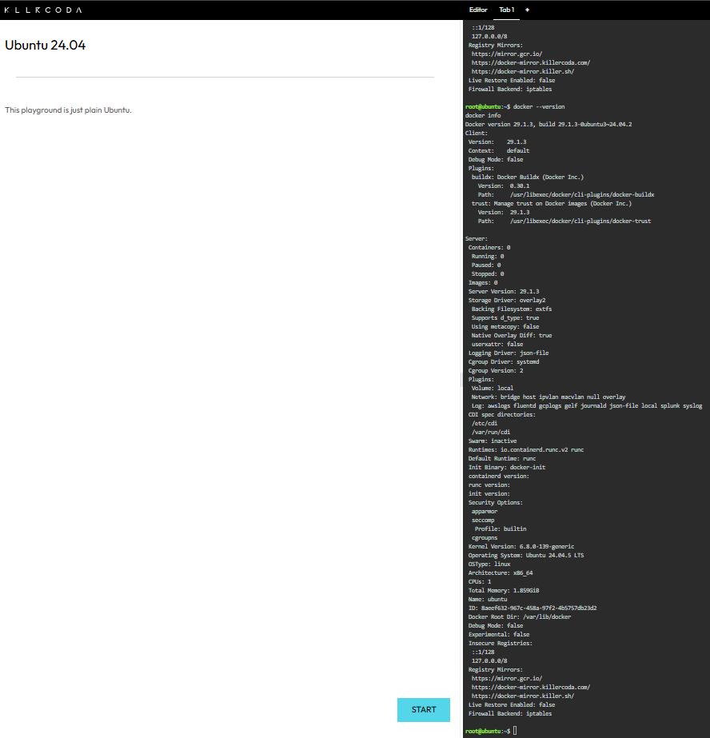
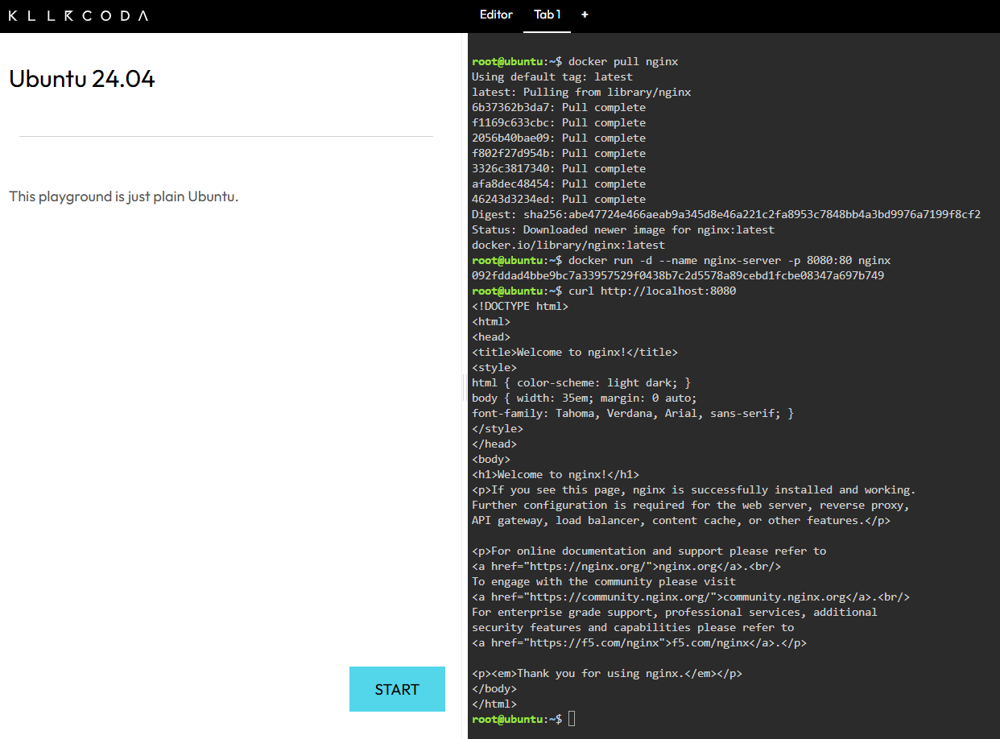
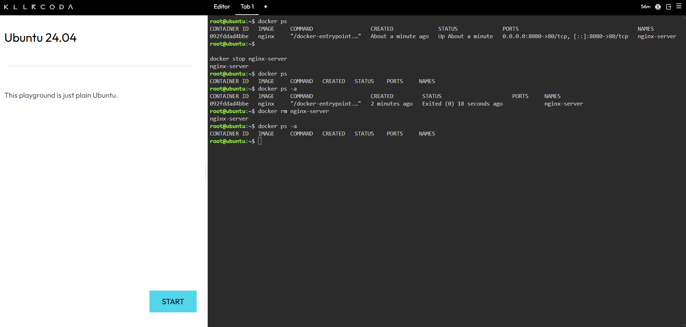

# Laboratory Activity 4 – Cloud-Native Engineer

## Mission Overview

This laboratory activity introduces containerization using Docker. The mission focuses on understanding the differences between Virtual Machines and Containers and deploying an Nginx web server using a Docker container. It also covers basic Docker commands, port mapping, and container lifecycle management.

## Objectives

- Understand the differences between Virtual Machines and Containers.
- Verify that Docker is installed and running in a Linux environment.
- Pull the official Nginx image from Docker Hub.
- Run an Nginx container in detached mode.
- Use port mapping to access the web server.
- Verify that the Nginx web server is running.
- Manage the lifecycle of a Docker container.
- Document technical procedures using Markdown.
- Organize laboratory evidence in a GitHub repository.

---

## Docker Commands Executed

### Checkpoint 3 – Verify Docker Installation

#### Check Docker Version

```bash
docker --version
```

This command displays the installed Docker version.

#### Check Docker Environment

```bash
docker info
```

This command displays information about the current Docker environment, including the server, containers, images, storage, and system information.

---

### Checkpoint 4 – Deploy Nginx Container

#### Pull the Nginx Image

```bash
docker pull nginx
```

This command downloads the official Nginx image from Docker Hub.

#### Run the Nginx Container

```bash
docker run -d --name nginx-server -p 8080:80 nginx
```

This command creates and starts an Nginx container in detached mode. It also maps port 8080 on the host machine to port 80 inside the container.

#### Test the Nginx Web Server

```bash
curl http://localhost:8080
```

This command sends an HTTP request to the Nginx web server and displays the HTML response in the terminal.

---

### Checkpoint 5 – Container Lifecycle

#### List Running Containers

```bash
docker ps
```

This command displays the Docker containers that are currently running.

#### Stop the Nginx Container

```bash
docker stop nginx-server
```

This command stops the running Nginx container.

#### Verify the Container is Stopped

```bash
docker ps
```

This command checks the running containers and confirms that the Nginx container is no longer running.

#### View All Containers

```bash
docker ps -a
```

This command displays all containers, including both running and stopped containers.

#### Remove the Nginx Container

```bash
docker rm nginx-server
```

This command removes the stopped Nginx container from the Docker environment.

#### Verify Container Removal

```bash
docker ps -a
```

This command verifies that the `nginx-server` container has been removed.

---

## Skills Learned

Through this laboratory activity, I learned how to:

- Use the Docker command-line interface.
- Check the Docker installation and environment.
- Download Docker images from Docker Hub.
- Create and run containers.
- Deploy an Nginx web server using Docker.
- Use port mapping to access a service inside a container.
- Check running and stopped containers.
- Stop and remove Docker containers.
- Document technical procedures using Markdown.
- Organize screenshots and laboratory files in GitHub.

---

## Challenges Encountered

One challenge I encountered was understanding the difference between a Docker image and a Docker container. I learned that an image is used as the template for creating a container, while the container is the running instance of that image.

Another challenge was understanding port mapping. The `-p 8080:80` option initially required some practice to understand because port 8080 belongs to the host while port 80 is used by Nginx inside the container.

I also needed to carefully follow the container lifecycle commands because the container had to be stopped before it could be removed. Using KillerCoda allowed me to practice the commands in a Linux environment and observe the results directly.

---

## Screenshots

### Docker Version and Environment

The screenshot below shows the Docker version and Docker environment information.



---

### Nginx Running

The screenshot below shows the successful HTTP request to the Nginx web server using `curl`.



---

### Container Lifecycle

The screenshot below shows the commands used to manage the Nginx container lifecycle.



---

## Repository Structure

```text
Laboratory-04-Cloud-Native-Engineer/
│
├── README.md
├── virtualization-vs-containers.md
├── docker-deployment.md
├── reflection.md
│
└── screenshots/
    ├── docker-version.png
    ├── nginx-running.png
    └── container-lifecycle.png
```

## Mission Success

This laboratory activity demonstrates the basic use of Docker for containerized application deployment. I was able to verify Docker, download and run an Nginx image, expose the web server using port mapping, and manage the container lifecycle. The activity also improved my ability to document technical procedures and maintain a structured cloud computing portfolio using GitHub.
